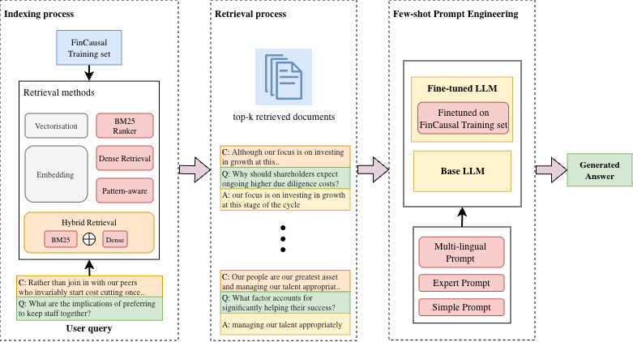

# FinCausal 2026: RAG Pipeline for Financial Causal QA
This repository contains the code for a system submitted to the FinCausal 2026 shared task on causal question answering from financial documents.

## Overview

We investigate the effectiveness of fine-tuned generative models combined with Retrieval-Augmented Generation (RAG) for verbatim causal extraction from financial texts. Our system compares multiple retrieval strategies for few-shot example selection and evaluates their impact on both base and fine-tuned GPT models.

### Key Findings

- **Fine-tuning is the dominant factor**, nearly doubling exact match scores across both languages.
- **Retrieval strategy has minimal impact after fine-tuning**, with all methods yielding comparable results (EM variance < 2%).
- **RAG benefits are more pronounced for Spanish**, where the base model has weaker zero-shot performance.

## Architecture



The pipeline consists of three stages:

1. **Indexing** — Training examples are indexed using multiple retrieval methods.
2. **Retrieval** — Top-k most relevant examples are retrieved for each test query.
3. **Few-shot Prompt Engineering** — Retrieved examples are combined with the test query and passed to the LLM.

## Retrieval Strategies

| Strategy | Description |
|---|---|
| **Random** | Randomly sampled training examples |
| **BM25** | Sparse lexical retrieval with language-specific stemming |
| **Dense** | Semantic retrieval using `text-embedding-3-large` |
| **Hybrid** | BM25 + Dense combined via Reciprocal Rank Fusion (RRF) |
| **Pattern-RAG** | Template-aware retrieval (CAUSE/EFFECT/OTHER) using FAISS |

## Project Structure
'''
├── Dataset/                        # Training and evaluation data
├── Finetuning/                     # Fine-tuning scripts and configs
├── Images/                         # Figures and diagrams
├── eval/                           # Evaluation results
├── indexes/                        # Pre-built retrieval indexes
│   ├── build_indexes.py            # Build BM25 + Dense indexes
│   └── indexing.sh                 # Index building shell script
├── prompts/                        # Prompt templates
│   ├── best_template.json          # Best performing template
│   ├── causal_template.json        # Basic causal extraction
│   ├── expert_template.json        # Domain-expert prompt
│   ├── multingual_expert.json      # Multilingual expert prompt
│   └── multingual_expert_cot.json  # Multilingual expert with CoT
├── utils/                          # Utility modules
│   ├── __init__.py
│   ├── template.py                 # CAUSE/EFFECT/OTHER classifier
│   ├── evaluation.py               # EM, SAS, partial match metrics
│   ├── retrieval.py                # All retrieval methods
│   └── data_loader.py              # HuggingFace + CSV data loading
├── .gitignore
├── LICENSE
├── README.md
├── requirements.txt                # Dependencies
├── inference.py                    # Main inference script
└── run_inference_english.sh        # Example shell script
'''
## Installation

```bash
pip install -r requirements.txt
```

## Datasets

Datasets are available on HuggingFace:

| Dataset | Split |
|---|---|
| English (train + dev) | train, validation |
| English (full train) | train |
| English (blind test) | test |
| Spanish (train + dev) | train, validation |
| Spanish (full train) | train |
| Spanish (blind test) | test |

Datasets will be made publicly available after the review period.

## Usage

### 1. Build Indexes

```bash
export OPENAI_API_KEY="sk-..."

# English
python build_indexes.py \
  --hf_dataset "your-hf-username/fincausal-2026-en" \
  --hf_split train \
  --persist_dir ./indexes/english \
  --language english \
  --embed_model text-embedding-3-large

# Spanish
python build_indexes.py \
  --hf_dataset "your-hf-username/fincausal-2026-es" \
  --hf_split train \
  --persist_dir ./indexes/spanish \
  --language spanish \
  --embed_model text-embedding-3-large
```

### 2. Run Inference

**BM25 with fine-tuned model:**
```bash
python inference.py \
  --hf_dataset "your-hf-username/fincausal-2026-en" \
  --hf_split validation \
  --api_key "$API_KEY" \
  --template_file configs/best_template.json \
  --use_bm25 \
  --persist_dir ./indexes/english \
  --language english \
  --num_shots 5 \
  --use_ft \
  --eval --sas \
  --output_file results/bm25_5 \
  --debug_file debug/bm25_5.log \
  --eval_save eval/bm25_5.csv
```

**Dense retrieval:**
```bash
python inference.py \
  --hf_dataset "your-hf-username/fincausal-2026-en" \
  --hf_split validation \
  --api_key "$API_KEY" \
  --template_file configs/best_template.json \
  --use_dense \
  --persist_dir ./indexes/english \
  --embed_model text-embedding-3-large \
  --num_shots 5 \
  --use_ft \
  --eval --sas \
  --output_file results/dense_5 \
  --debug_file debug/dense_5.log \
  --eval_save eval/dense_5.csv
```

**FAISS Pattern-aware retrieval:**
```bash
python inference.py \
  --hf_dataset "your-hf-username/fincausal-2026-en" \
  --hf_split validation \
  --hf_train_dataset "your-hf-username/fincausal-2026-en-train" \
  --api_key "$API_KEY" \
  --template_file configs/best_template.json \
  --use_faiss \
  --faiss_embed_model "intfloat/multilingual-e5-large" \
  --persist_dir ./indexes/english \
  --num_shots 5 \
  --use_ft \
  --eval --sas \
  --output_file results/faiss_5 \
  --debug_file debug/faiss_5.log \
  --eval_save eval/faiss_5.csv
```

**Blind test submission (no eval):**
```bash
python inference.py \
  --hf_dataset "your-hf-username/fincausal-2026-en-test" \
  --hf_split test \
  --api_key "$API_KEY" \
  --template_file configs/best_template.json \
  --use_dense \
  --persist_dir ./indexes/english_full \
  --embed_model text-embedding-3-large \
  --num_shots 5 \
  --use_ft \
  --output_file submission/en_dense_5 \
  --debug_file debug/submission/en_dense_5.log
```

## Results

| Model | Mode | k | EN EM | EN SAS | EN LLM | ES EM | ES SAS | ES LLM |
|---|---|---|---|---|---|---|---|---|
| GPT-4.1-mini | Zero-shot | 0 | .353 | .861 | 4.460 | .025 | .888 | 4.300 |
| GPT-4.1-mini | RAG-Dense | 10 | .588 | .915 | 4.584 | **.508** | **.941** | 4.503 |
| GPT-4.1-mini | RAG-Hybrid | 10 | **.595** | **.915** | **4.594** | .458 | .937 | 4.471 |
| Fine-tuned | Zero-shot | 0 | .880 | .976 | 4.744 | .855 | .973 | 4.785 |
| Fine-tuned | RAG-Dense | 5 | **.888** | **.979** | **4.814** | **.863** | **.974** | 4.785 |
| Fine-tuned | RAG-Dense | 10 | .883 | .976 | 4.794 | .843 | .970 | **4.803** |

## Evaluation Metrics

- **EM** — Exact Match (case-insensitive string comparison)
- **SAS** — Semantic Answer Similarity (cosine similarity of sentence embeddings)
- **LLM** — Official blind test score by LLM-as-judge (1–5 scale)

